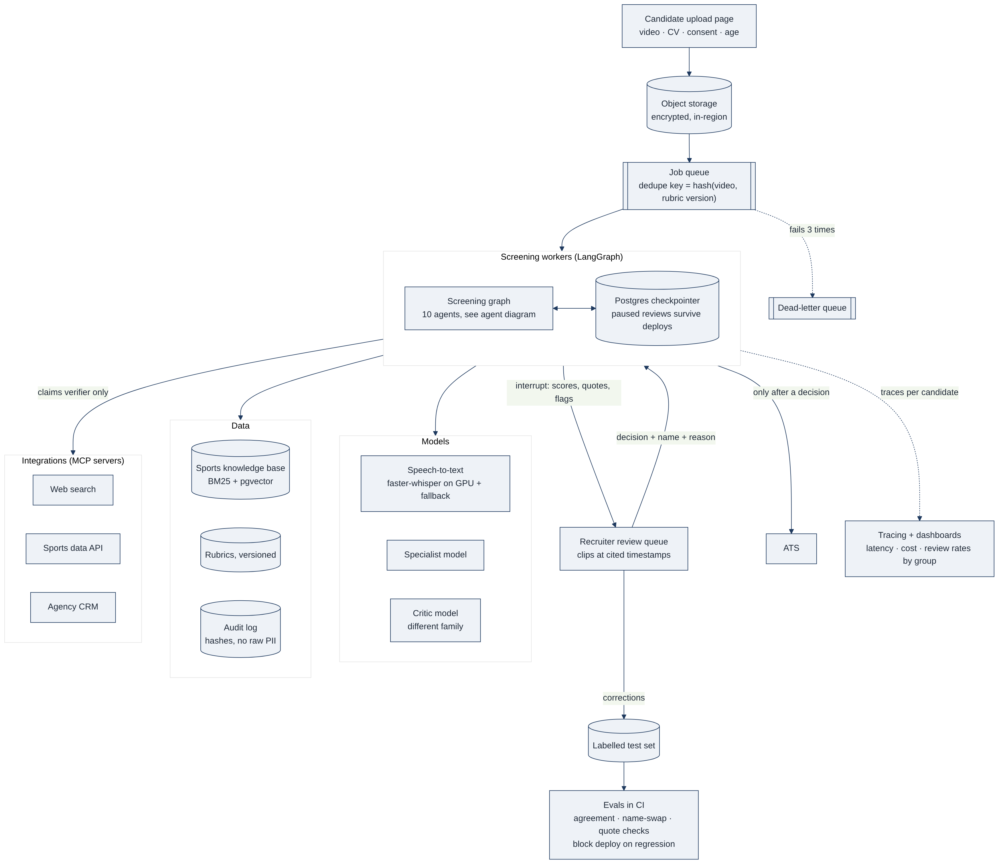
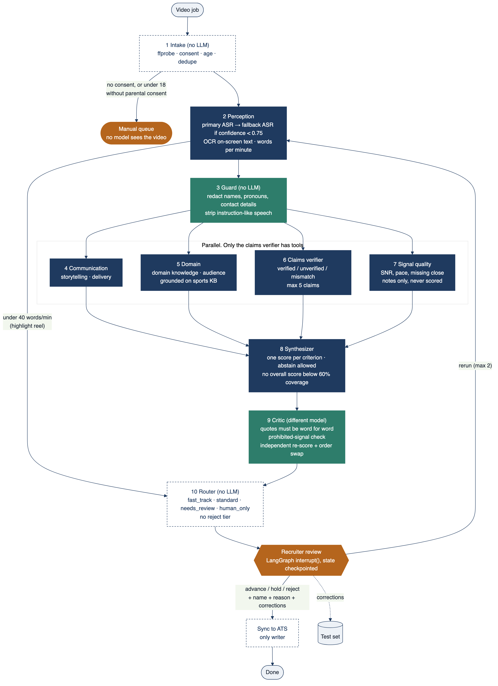
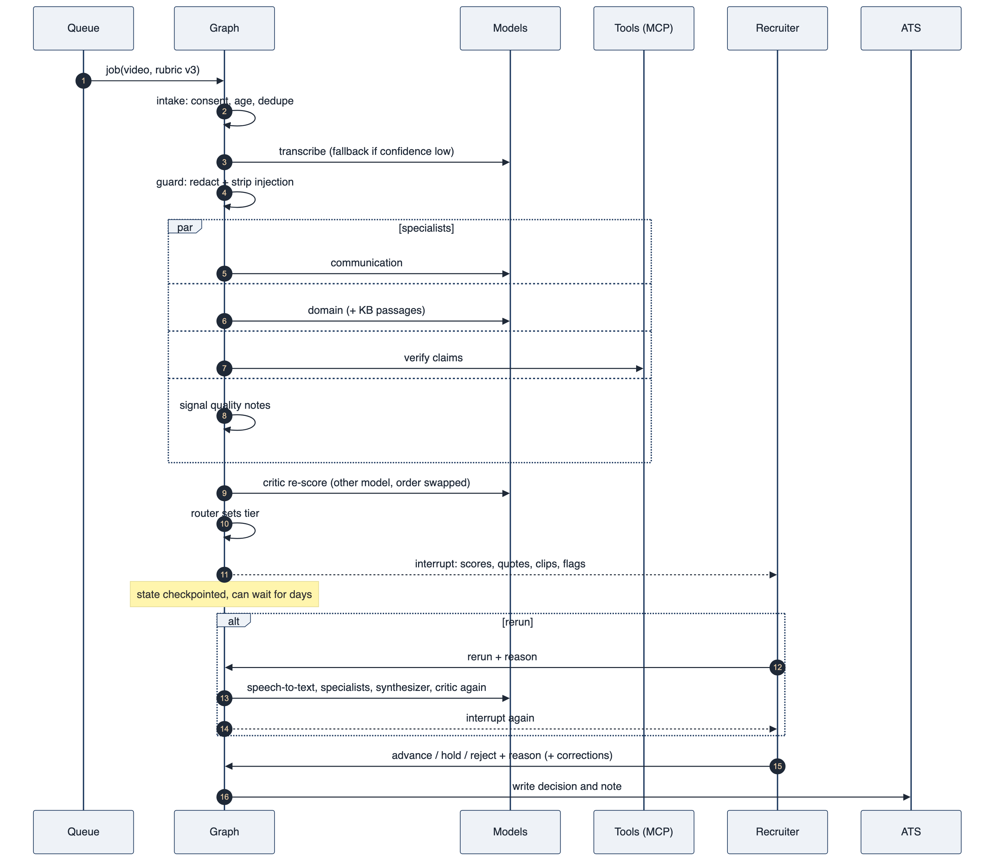

# Architecture

This goes one level deeper than the one-pager (`one-pager.pdf`). The diagrams are Mermaid source in `diagrams/*.mmd` (GitHub renders them inline) with PNG and SVG exports next to them.

## 1. System view

How a video gets from the candidate to a recruiter's decision, and what the workflow talks to.

A few things worth calling out:

- **Everything is async.** The upload lands in object storage and a job goes on a queue. Workers pick jobs up, so a spike in applications just makes the queue longer, not the system slower.
- **Dedupe key = hash(video, rubric version).** The same video against the same rubric is never scored twice. If the hiring manager changes the rubric, it gets a new version and a fresh run.
- **The checkpointer is what makes human review possible.** The graph pauses at the review step and its state goes to Postgres. A recruiter can come back days later, after a redeploy, and the run picks up where it stopped.
- **Only the claims verifier reaches the outside world**, and only through MCP servers with a capped number of calls. Everything else is a model call or plain code.
- **The ATS is written once, at the end**, after a person has decided.

## 2. Agent graph

The LangGraph `StateGraph` in `src/screener/graph.py`. Node names and numbers match the one-pager.

| # | Node | LLM? | Reads | Writes | Can fail by | What happens then |
|---|---|---|---|---|---|---|
| 1 | `intake` | no | media metadata, consent, age | `consent`, `age`, `tier` if blocked | no consent, minor without parental consent | stops; manual queue, no model sees the video |
| 2 | `perception` | ASR | video | `segments`, `asr_conf`, `low_speech` | noisy audio, accents, highlight reels | fallback ASR; if still low, flag for a person; highlight reels skip scoring |
| 3 | `guard` | no | `segments` | `redacted`, `claims` | injected instructions, PII | removed before any scorer sees the text |
| 4 | `communication` | yes | `redacted` | `reports.communication` | made-up quotes | critic drops them |
| 5 | `domain` | yes | `redacted`, sports KB | `reports.domain` | relying on model memory | grounded on retrieved KB passages |
| 6 | `claims_verifier` | tools | `claims` | `verifications` | tool errors, rate limits | retries with backoff; on failure the claim is "unverified", never "false" |
| 7 | `signal_quality` | no | media stats, `redacted` | `reports.signal_quality` (notes only) | n/a | never feeds the score |
| 8 | `synthesizer` | no | `reports` | `scores`, `coverage`, `weighted_score` | thin evidence | no overall score under 60% coverage |
| 9 | `critic` | yes, other model | `scores`, `redacted` | cleaned `scores`, flags | disagreement, order sensitivity | flags for review; bad scores dropped |
| 10 | `router` | no | flags, score | `tier` | n/a | there is no reject tier |
| – | `recruiter_review` | person | everything above | `decision`, `corrections` | missing name or reason | rejected; must be filled in |
| – | `sync_ats` | no | `decision` | ATS | ATS down | retried; graph state is already saved |

### State

`src/screener/state.py`. Two details matter:

- The four specialists write into `reports`, a dict keyed by agent name with a merge reducer. They run in parallel without overwriting each other, and when a recruiter asks for a re-run the new report replaces the old one instead of being added next to it.
- `flags` works the same way, keyed by `agent:code`, so the same problem isn't reported twice.

### Tiers

| Tier | When |
|---|---|
| `fast_track` | no flags, overall score ≥ 3.8 |
| `standard` | no flags, score below that |
| `needs_review` | any flag, or no overall score |
| `human_only` | no consent, minor without parental consent, or a highlight reel |

Tiers set the order of the queue. Every candidate is still seen by a person.

## 3. One candidate, step by step

## 4. Trust boundaries

| Data | Who sees it |
|---|---|
| Raw video and audio | object storage, speech-to-text, the recruiter |
| Raw transcript | perception and guard only |
| Redacted transcript | specialists and critic |
| Scores, quotes, flags | recruiter, hiring manager |
| Audit log | hashes and IDs, no names or contact details |

## 5. What's built vs. what's on the page

The one-pager says I'd ship a smaller first version and add the rest once shadow mode shows where it's wrong. This repo has the full graph so the shape is clear, with stand-ins where real services would go.

| Piece | In this repo | In production |
|---|---|---|
| Graph, routing, interrupt, re-run | real (LangGraph) | same |
| Guard: redaction, injection strip | real, regex based | add an NER model and an injection classifier |
| Critic checks: quotes, prohibited signals, disagreement, order swap | real | same, on a different model family |
| Scoring agents | keyword stand-in (`MockJudge`), or any OpenAI-compatible model | hosted or self-hosted model (vLLM) |
| Speech-to-text | fixture transcripts | faster-whisper on GPU + fallback vendor |
| Knowledge base | 3 passages, keyword match | BM25 + pgvector |
| Claims checks | lookup table | web search, sports data API, CRM via MCP |
| Checkpointer | in memory | Postgres |
| ATS | in-memory log | ATS API |
